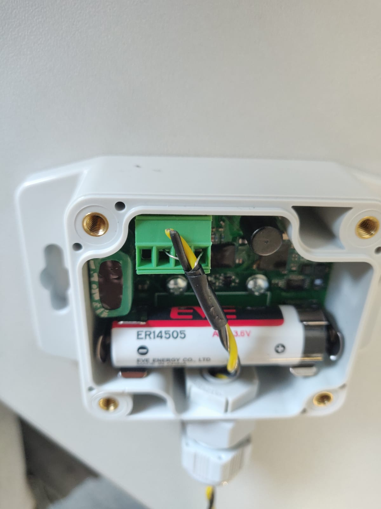

# Aufbau

Pro Prototyp werden zwei link:Elsys_ELT2/README.adoc[ELT-2 Boxen] von Elsys verwendet. Die Boxen werden so konfiguriert, dass sie in regelmäßigen Abständen
die Batteriespannung und zwei Analogwerte senden.

Ein gesendeter Wert kann damit zum Beispiel *0x070E45080000180DA3* sein. Die Zahlen 0x07; 0x08; 0x18 sind identifier um zu erkennen welcher Wert was anzeigt. Die Zahlen nach diesen Werten sind die jeweiligen Werte zu den identifiern

* 0x07 *->* Batteriespannung
* 0x08 *->* Analog 1
* 0x18 *->* Analog 2

Zur Feuchtigkeitserkennung wird das https://www.elsys.se/shop/product/water-leak-sensor-cable/?v=f003c44deab6[Water leak sensor cable] und zur externen Temperaturmessung wird der https://www.elsys.se/shop/product/external-temperature-probe-2m/?v=f003c44deab6[Temperatursensor] von Elsys verwendet. Da pro Box nur ein nutzbarer Analogeingang vorliegt, bekommen die beiden unterschiedlichen Sensoren jeweils eine eigene LoRa-Box. Im Falle des Water-Leak-Cables müssen die silbernen Drähte mit dem Sensor wie auf dem folgenden Bild verbunden werden (Anschlussplan in der link:Elsys_ELT2[Anleitung für den ELT2]).

 

Die gelben und schwarzen Kabel sind nur für die Stabilität vorhanden. Der Widerstand zwischen den beiden Drähten wird über ein PWM-Signal gemessen. Je länger das Kabel ist, desto höher ist der Null-Wert also der Wert bei Trockenheit. Sobald mehr als 4 cm des Kabels unter Wasser sind wird der Maximalwert (255) angezeigt. Ob die Messmethodik zur Glatteiserkennung mittels Feuchtigkeits- und Temperaturerfassung funktioniert, ist in verschiedenen link:../Testreihen[Testreihen] untersucht worden.