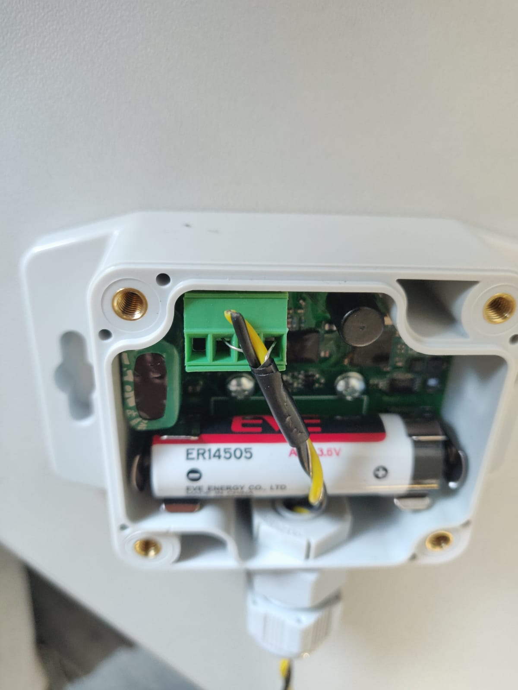

# Hardware

## Elsys

Pro Prototyp werden zwei link:Elsys_ELT2/README.adoc[ELT-2 Boxen] von Elsys verwendet. Die Boxen werden so konfiguriert, dass sie in regelmäßigen Abständen
die Batteriespannung und zwei Analogwerte senden.

Ein gesendeter Wert kann damit zum Beispiel *0x070E45080000180DA3* sein. Die Zahlen 0x07; 0x08; 0x18 sind identifier um zu erkennen welcher Wert was anzeigt. Die Zahlen nach diesen Werten sind die jeweiligen Werte zu den identifiern

* 0x07 *->* Batteriespannung
* 0x08 *->* Analog 1
* 0x18 *->* Analog 2

Die Sensoren lassen sich über die Sensor Settings App der Firma über NFC konfigurieren. Dafür wird das Handy mit dem NFC Chip an den NFC Chip der Sensoren (Position im Datenblatt angegeben) gehalten. Über NFC können die Einstellungen gelesen werden und die Sensoren neu eingestellt werden.

Zum Einrichten der Sensoren zuerst in TTN einen neuen Sensor anlegen (Die Device EUI steht auf dem Sensor). Danach lassen sich wenn OTAA ausgeschalten ist (im TTN und in der Elsys App) unter dem Abschnitt Sensor Keys die device address, der app session key und der network session key eintragen. Durch den Button write in der App lässt sich der Sensor wieder über NFC beschreiben.

Wenn die Sensoren im Feld sind, sind sie meistens über den Button Lock gesperrt (in der App unter Advanced). Die Sensoren lassen sich mit einem selbstgewählten Code entsperren und auch wieder sperren.

## Aufbau

Zur Feuchtigkeitserkennung wird das https://www.elsys.se/shop/product/water-leak-sensor-cable/?v=f003c44deab6[Water leak sensor cable] und zur externen Temperaturmessung wird der https://www.elsys.se/shop/product/external-temperature-probe-2m/?v=f003c44deab6[Temperatursensor] von Elsys verwendet. Da pro Box nur ein nutzbarer Analogeingang vorliegt, bekommen die beiden unterschiedlichen Sensoren jeweils eine eigene LoRa-Box. Im Falle des Water-Leak-Cables müssen die silbernen Drähte mit dem Sensor wie auf dem folgenden Bild verbunden werden (Anschlussplan in der link:Elsys_ELT2[Anleitung für den ELT2]).

 

Die gelben und schwarzen Kabel sind nur für die Stabilität vorhanden. Der Widerstand zwischen den beiden Drähten wird über ein PWM-Signal gemessen. Je länger das Kabel ist, desto höher ist der Null-Wert also der Wert bei Trockenheit. Sobald mehr als 4 cm des Kabels unter Wasser sind wird der Maximalwert (255) angezeigt. Ob die Messmethodik zur Glatteiserkennung mittels Feuchtigkeits- und Temperaturerfassung funktioniert, ist in verschiedenen link:../Testreihen[Testreihen] untersucht worden.

- *link:../Testreihen[Testreihen]*