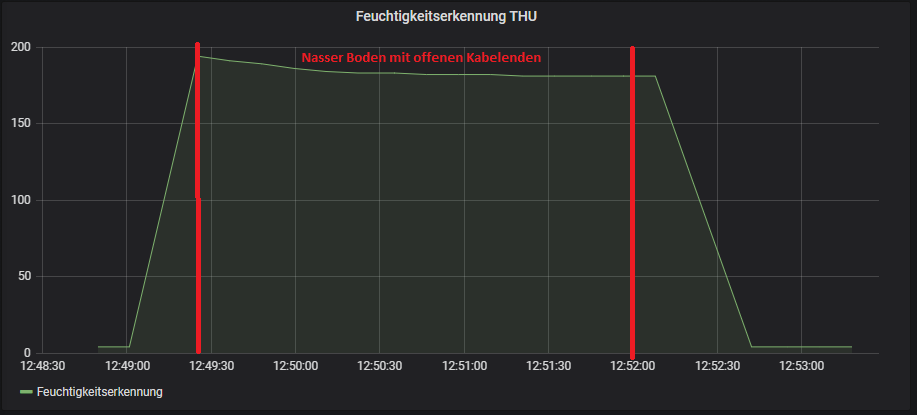

# Testreihe 1

Test ob das Water Leak Sensor Cable Nässe und Schnee erkennt. Der erste Test besteht daraus Nässe und Schnee mit verdrillten Kabeln zu messen.
Beim zweiten Test wird Nässe mit offenen Kabeln gemessen. Der Aufbau ist auf dem Folgenden Bild sichtbar.

image::Drähte_offen_verdrillt.png[Drähte_offen_verdrillt.png]

Der nasse Boden bei den Tests ist auf dem folgendem Bild sichtbar.

image::Boden_Test12.png[Boden_Test12.png]

Die Ergebnisse der beiden Tests sind auf den folgenden Bildern sichtbar. Beim ersten Bild wurde mit einem verdrillten Draht gemessen und sowohl Schnee als auch der nasse Boden gemessen. Beim zweiten Bild wurde mit offenen Kabeln nur noch der nasse Boden gemessen, da die Schneemessung beim ersten Test schon erfolgreich war und kein anderes Ergebnis erwartet wurde. +
Es hat sich gezeigt, dass das Sensor Kabel Sowohl nässe als auch Schnee erkennen kann. Zum erkennen der Nässe sollte das Kabel jedoch offen sein, da die silbernen Drähte nur so Kontakt mit dem Boden bekommen können.

image::Testreihe1_Test1.png[Testreihe_1_Test_1.png]

