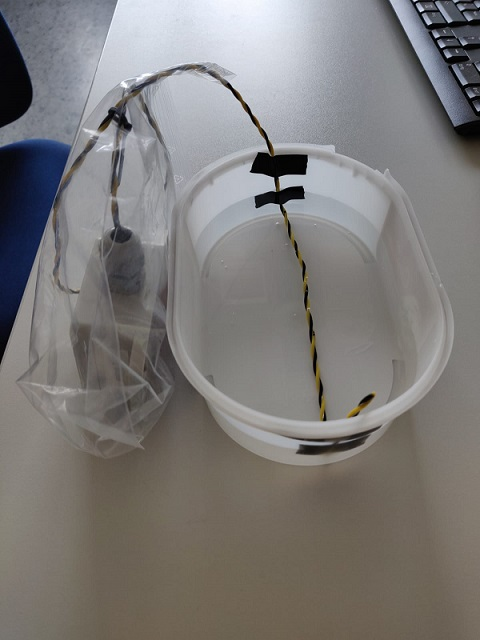
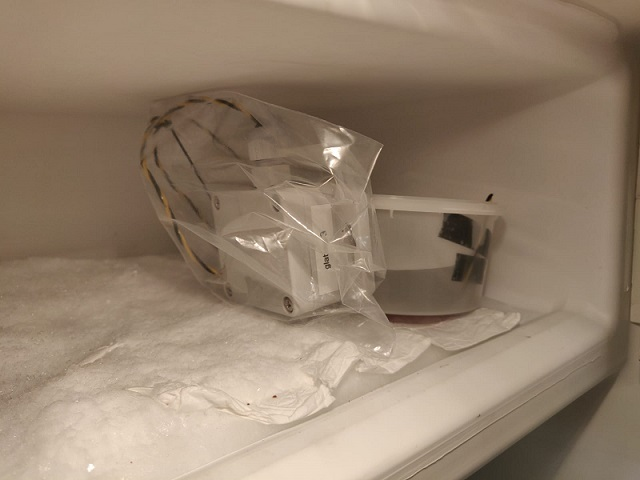
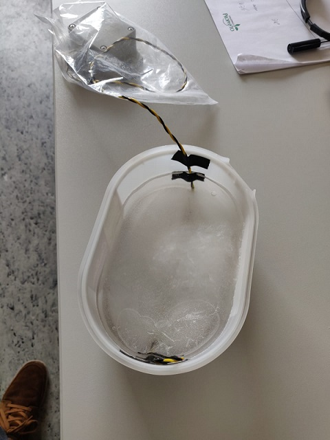
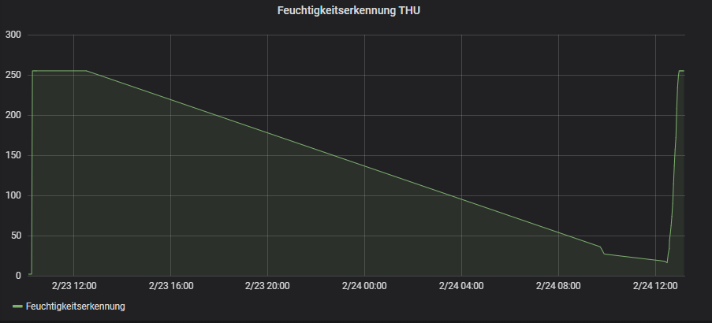
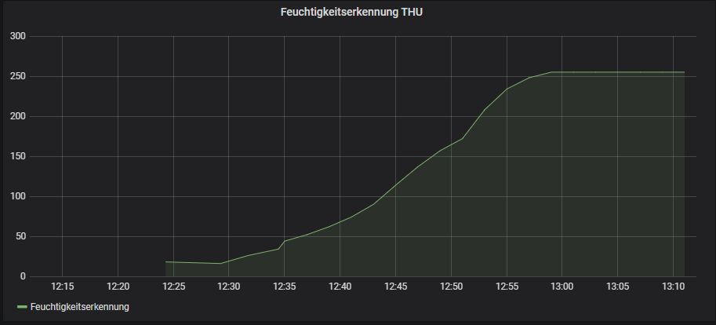

# Vergleich Wasser/Eis

Es soll festgestellt werden wie sich der ausgegebene Feuchtigkeitswert ändert, wenn Wasser gefriert. Ziel ist es festzustellen ob und wie sich die Leitfähigkeit des Wassers
beim gefrieren ändert, und ob dadurch speziell Eis Festgestellt werden kann.

*Aufbau*

Das Water Leak Sensor Kabel wird in einer flachen Schüssel, die mit Wasser gefüllt ist, unter Wasser befestigt. Damit der Rest des Kabels nicht mit den vereisten Wänden des Gefrierfachs in Berührung kommt und die Werte verfälscht werden, ist das Kabel mit der Box in einer Tüte verpackt. 
Anfangs wird der Wert gemessen, wenn das Kabel unter Wasser ist.
Danach wird der Aufbau in ein Gefrierfach gelegt und es Wird gewartet bis das Wasser gefroren ist (Dies hat im Versuch 24 h gebraucht). Dann lässt sich der Wert messen, der sich einstellt, wenn das Kabel
von Eis umgeben ist. Der Aufbau ist im folgenden Bild nochmal genau dargestellt.

Der Aufbau im Gefrierfach:

Der Aufbau nachdem das Wasser gefroren ist:

*Ergebnis*

[horizontal]
Zustand:: gemessener Wert
Anfangswert im trockenen Zustand ohne Wasser:: *2* (10:05-10:15)
Schüssel mit Wasser gefüllt::                  *255* (10:17-10:27)
Wasser gefroren (nächster Tag)::                            *16* (12:30-13:10)

An  der Kompletten Messreihe lässt sich erkennen, dass der Sensor einen geringeren Wert sendet, wenn das Kabel von Eis umschlossen ist. Leider kann die LoRa Box nicht durch die Kühlschrankwände senden. Deshalb ist der Bereich während dem der Sensor im Kühlschrank ist nur durch die Verbindung der Werte vor und nach dem Kühlschrank abgedeckt und kann nicht in die betrachtung mit aufgenommen werden.

Am nächsten Bild sieht man die Messwerte nachdem der Sensor aus dem Kühlschrank entfernt wurde genauer. Es lässt sich erkennen, dass als Mindestwert im Eis ein Wert von 16 gemessen wurde. Durch die Wärme schmilzt das Eis um das Water Leak Sensor Kabel schnell und es wird wieder ein Wert von 255 gemessen, der dem Wert des Kabels im Wasser entspricht. Der Auftauvorgang ist genauer auf dem folgenden Bild dargestellt.

